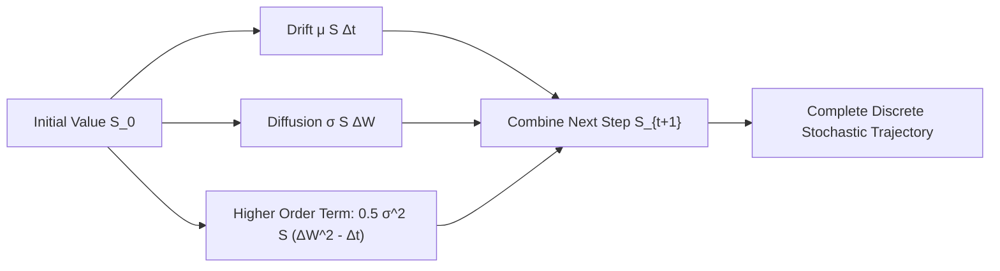

# Euler-Maruyama & Milstein SDE Solvers Skill

High-order numerical integration schemes for Itô stochastic differential equations with Brownian increments.

## Features
- **100% Python Standard Library**: Box-Muller Gaussian generation.
- **Order 1.0 Strong Convergence**: Milstein scheme eliminates discretization bias.
- **MCP Server Ready**: Instant stdio simulation for agent forecasting.
